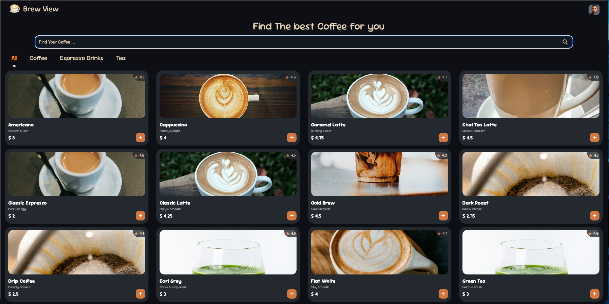
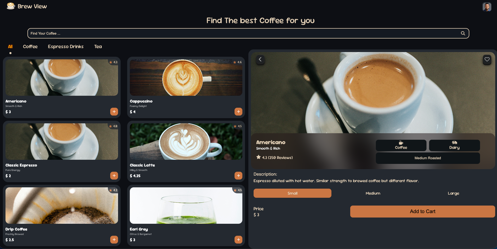
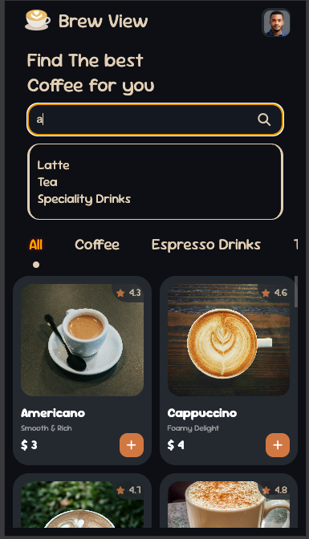
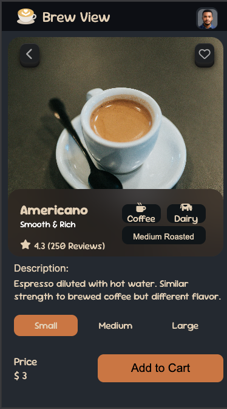
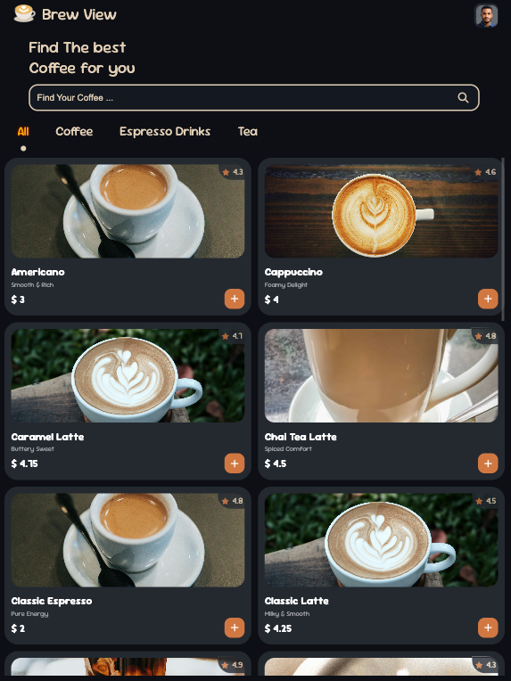

<a name="readme-top"></a>
<!-- PROJECT LOGO -->
<br />
<div align="center">

  <h2 align="center">BrewView</h2>

  <a href="https://github.com/Savant35/wiseshare">
    
  </a>

  <p align="center">
    BrewView is a dynamic front-end application designed to showcase a coffee shop's product offerings. It features an interactive, filterable catalog driven by real-time data to provide users with a fast and intuitive browsing experience. The primary goal was to build a modern, scalable product display layer completely decoupled from the back-end logic, utilizing Appwrite as a powerful and flexible data source.
    <br />
    <a href="#preview">Preview </a>
    .
    <a href="https://github.com/Savant35/BrewView/issues">Report Bug</a>
    .
    <a href="https://github.com/Savant35/BrewView/pulls">Request Feature</a>
  </p>
</div>

</div>
<!-- TABLE OF CONTENTS -->
<details>
  <summary>Table of Contents</summary>
  <ol>
    <li>
      <a href="#about-the-project">About The Project</a>
    </li>
    <li>
      <a href="#getting-started">Getting Started</a>
      <ul>
        <li><a href="#prerequisites">Prerequisites</a></li>
        <li><a href="#installation">Installation</a></li>
      </ul>
    </li>
    <li><a href="#preview">Preview</a></li>
    <li><a href="#license">License</a></li>
  </ol>
</details>

<!-- ABOUT THE PROJECT -->
## About The Project
BrewView is a front-end application leveraging the Decoupled Architecture pattern to create a robust and dynamic product catalog. It demonstrates proficiency in:

- Real-Time Data Handling: Utilizing Appwrite's comprehensive API and SDK to perform high-speed queries, filters, and state management for product data.

- Scalability & Maintainability: By operating as a strictly client-side application, it minimizes back-end resource usage and simplifies the deployment pipeline.

- Intuitive UX: Implementing advanced filtering, searching, and sorting features to provide users with a fast and targeted way to browse products.

<p align="right">(<a href="#readme-top">back to top</a>)</p>

<!-- GETTING STARTED -->
## Getting Started

### Prerequisites
* **Appwrite:** (Backend-as-a-Service) Used for database, storage, and API.
* **Vanilla JavaScript:** Powers all client-side logic, filtering, and interactions.
* **Web Fundamentals:** Working knowledge of HTML5 and CSS3 for structure and styling.


### Installation
```sh
https://github.com/Savant35/BrewView.git
cd BrewView
```

## preview 
<div style="display: flex; flex-wrap: wrap; justify-content: center; gap: 10px; width:100%">
  
  
  
  
  
  </div>
</div>

<!-- LICENSE -->
## License

Distributed under the MIT License.

<p align="right">(<a href="#readme-top">back to top</a>)</p>
